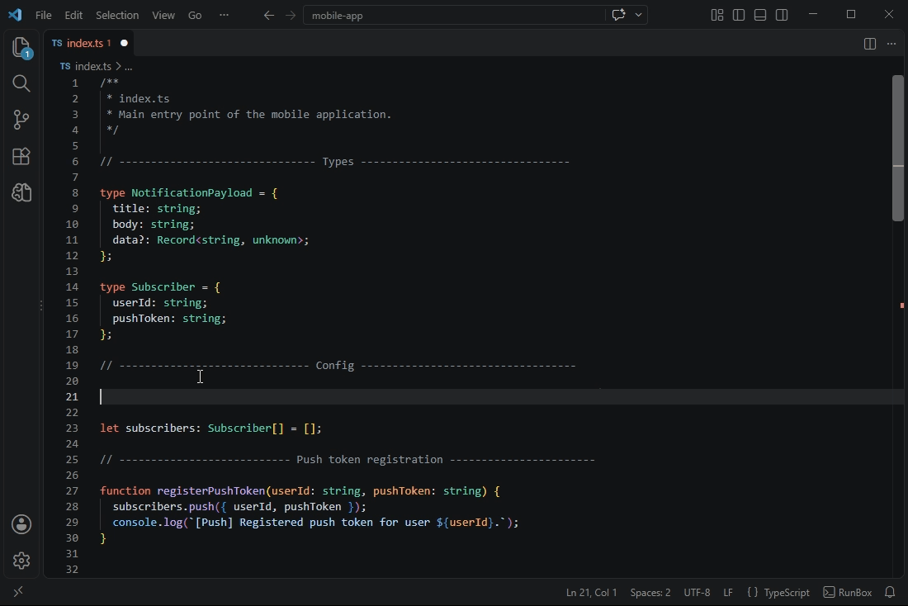
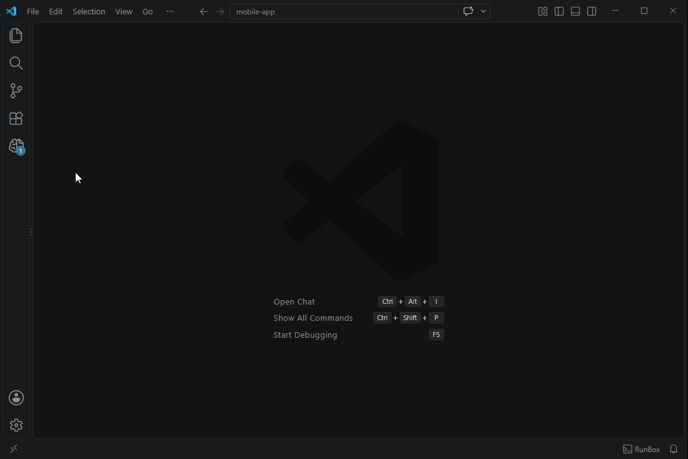

<a href="https://github.com/Abdulla-Aldosari/MindStream">
        </a><!-- </a> being on the same line as the  tag is intentional! -->

# MindStream for Visual Studio Code

Capture notes and ideas as they happen, organize them into custom types
and categories, and track their status.



*A thought strikes mid-code. One shortcut later, it's a saved note, without ever leaving the editor.*

## Features
- Flexible note cards in the sidebar (title + description + type + category + status), with a detail viewer modal.
- Quick note creation via the `Ctrl+Alt+M` / `Cmd+Alt+M` shortcut or the "+ Note" button.
- Fully customizable types: add, rename, delete (with reassignment), and pick an icon from the built-in codicon set — records keep their type safely via stable IDs.
- Customizable categories with a protected built-in "General" category (rename allowed, delete blocked). Deleting a category deletes its notes.
- Category filter dropdown ("All Categories") to focus the list on one category at a time.
- Three statuses — None / In Progress / Done — with one-click cycling, `Ctrl+Click` (or `Cmd+Click` on macOS) for direct jumps, and an append-only completion history.
- Archiving fully independent of status (never changes a "Done" status), with a show/hide archive toggle.
- View modes: Auto Sort / Fixed Order / Grouped (collapsible status sections with per-status counters).
- Smooth reorder animations and a flash highlight on status change.
- Delayed, arrowed, viewport-clamped status tooltips.
- Export Markdown and Export JSON.
- Import JSON with merge/replace options.
- Weekly Report modal, plus Export Weekly Report (Markdown).
- A clear "open a folder" message when no workspace is open.

## Organize & Customize



*Add a category, create a type with its own icon, cycle a note through its
statuses, archive it once it's done, then filter the list back down by
category, all from the sidebar.*

## Settings

| Setting | Type | Default | Description |
| --- | --- | --- | --- |
| `mindstream.ui.direction` | `"ltr"` \| `"rtl"` | `"ltr"` | Reading direction for note titles and descriptions. Use `"rtl"` to read Arabic notes right-to-left; the interface keeps VS Code's default direction and all labels remain in English. |

## Storage
A single JSON file inside the workspace: `.mindstream/data.json`. Because it's a normal project file, you can commit it to Git to sync or back it up — or add it to `.gitignore` to keep it private to you. Writes are atomic (temp file + rename) to avoid corruption.

> [!NOTE]
> 📁**Multi-root workspaces:** MindStream uses the first folder of the workspace by default. All notes are read from and written to `.mindstream/data.json` inside that first folder.

## Commands
- `MindStream: Quick Note`
- `MindStream: Manage Types`
- `MindStream: Manage Categories`
- `MindStream: Refresh`
- `MindStream: Open MindStream Panel`
- `MindStream: Export Markdown`
- `MindStream: Export JSON`
- `MindStream: Import JSON`
- `MindStream: Weekly Report`
- `MindStream: Export Weekly Report`

## Requirements
- VS Code `1.85.0` or newer.

## Development
```
npm install
npm run compile   # build with esbuild
npm run watch     # build in watch mode
npm test          # tests (Mocha + ts-node)
npm run package   # package with vsce
```
Press F5 to launch the Extension Development Host.

## License
[MIT](LICENSE) © 2026 Abdulla Aldosari

